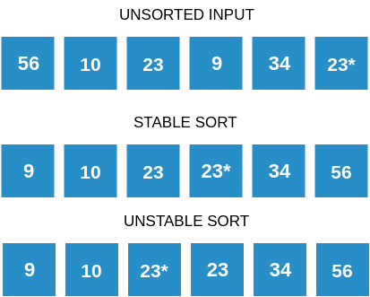
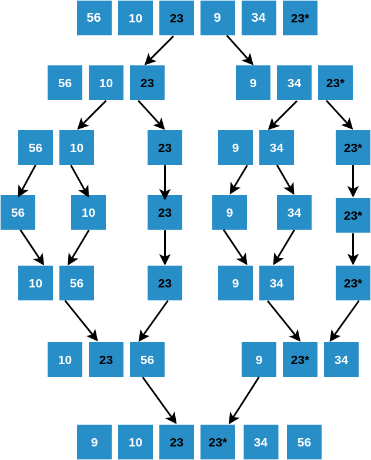

## What is a Comparison Sort Algorithm?

  -  A Comparison Sort is a sorting algorithm where the final order is determined only by comparisons between the input elements.
  -  In Merge Sort, the merge procedure chooses an item from one of two arrays after comparing the top items from both arrays.
   - Hence we can say that Merge Sort is a Comparison Sort algorithm.

### What is a Stable Sort Algorithm?
A sorting algorithm is said to be **stable** if two objects with equal keys appear in the same order in sorted output as they appear in the input unsorted array. For example, look at the picture below. The unsorted array has two elements with value 23. Note the order of both these elements in the stable and unstable sorted arrays.

### Stable and Unstable Sort

### Is Merge Sort stable?

Yes, Merge Sort is a stable sorting algorithm. Look at the picture below and keep and eye out for the ordering of 23 and 23*. Note how the original order of these elements is retained throughout the sorting process. The relative positioning of **23** and **23*** does not change in the sorted output.
### Stability of Merge Sort

