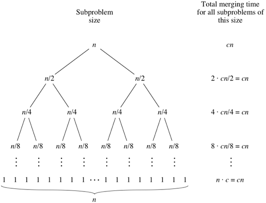
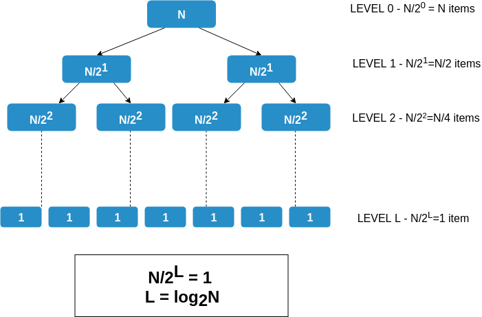

## Running Time of Merge Sort

Lets assume that we are sorting n elements of a given array.

  -  The **split** step, takes constant time, regardless of the subarray size, as this step just computes the midpoint of the array. We indicate constant time by **Θ(1)**.
  -  The **merge** step merges a total of n elements, taking **Θ(n)** time.
  -  To make things more concrete, let's say that the split and merge steps together take cn time for some constant c.

### Merging at Different Levels

### Understanding the Merge Sort Tree

   - We have seen that merging an array of size N takes time cN.
   - For array of size N/2, merging will be of order cN/2. For size N/x, merging will be of order cN/x.
   - From the image, we can observe that at level L, we have L arrays of size N/L, and hence total merging time is **L * c(N/L) = cN** for each level.

### Understanding Log(N) Levels

### Understanding the Log(N) Levels

The total time for Merge Sort is the sum of the merging times for all the levels. If there are **L** levels in the tree, then the total merging time is **L * cN**.

So what is L? We start with subproblems of size N and repeatedly halve until we get down to subproblems of size 1.

   - If **N = 2K** at level 0, then at level 1, each array is of size 2^(K-1). At level 2, each array is of size 2K-2 and at level l, each array is of size 2K-l.
   - This implies that at the last level, since size of each array is 1, **2K-L = 1.**
   - This implies that **(K-L) = 0**. Hence, total levels (L) in the merge sort tree is K. And since N = 2K, **K = log2(N)**.
   - Total running time of merge sort is **Θ(Nlog2N)**.

### Space Complexity of Merge Sort

While merging two arrays, we require an auxillary space to temporarily store the merged array, before we plug this partially sorted array into the main array. Hence space complexity of Merge Sort is **O(N)**, as we require an auxillary array as big as the main input array.

