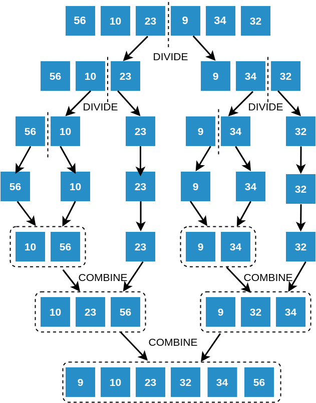

## Sorting as a Divide and Conquer Problem

### Can we perform Sorting using Divide and Conquer?

- We can visualise sorting an array of size N as two subproblems : sorting two arrays of size N/2, and then somehow combining the two smaller sorted arrays. Sorting a smaller array will be easier than sorting the bigger array.

- **Recursive nature of Sorting** : Sorting an array of size N can be recursively broken down into sorting two smaller arrays of N/2, and each of these smaller arrays can be broken down into even smaller arrays of size N/4 each, and so on.

- Merge sort is a sorting algorithm that uses this approach. In Merge Sort we will:

- **DIVIDE** : Split an array into parts recursively into half.

- **CONQUER** : Sort the sub-arrays individually.

- **COMBINE** : Merge the sorted sub-arrays to get a big sorted array.

Look at the image below and identify the divide steps and the combine steps.

### Divide and Conquer in Sorting

