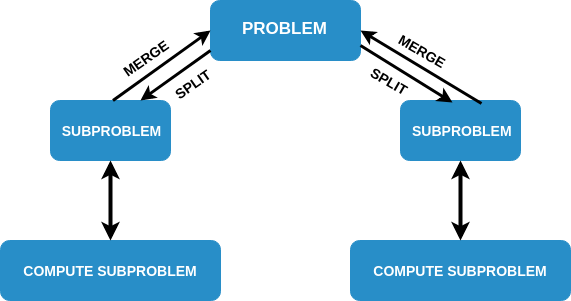

### Divide and Conquer Strategy

### Concept

- Divide and conquer is a strategy based on the idea that a given hard problem can be solved by breaking it down into smaller subproblems, which are much easier to solve. A Divide and Conquer algorithm works by recursively breaking down a problem into two or more sub-problems of similar type, until these become simple enough to be solved directly.

- The solutions to the sub-problems are then combined to give a solution to the original problem. A typical Divide and Conquer algorithm solves a problem using following three steps:

- **Divide** : Break the given problem into subproblems of same type.

- **Conquer** : Recursively solve these subproblems.

- **Combine** : Appropriately combine the answers.

