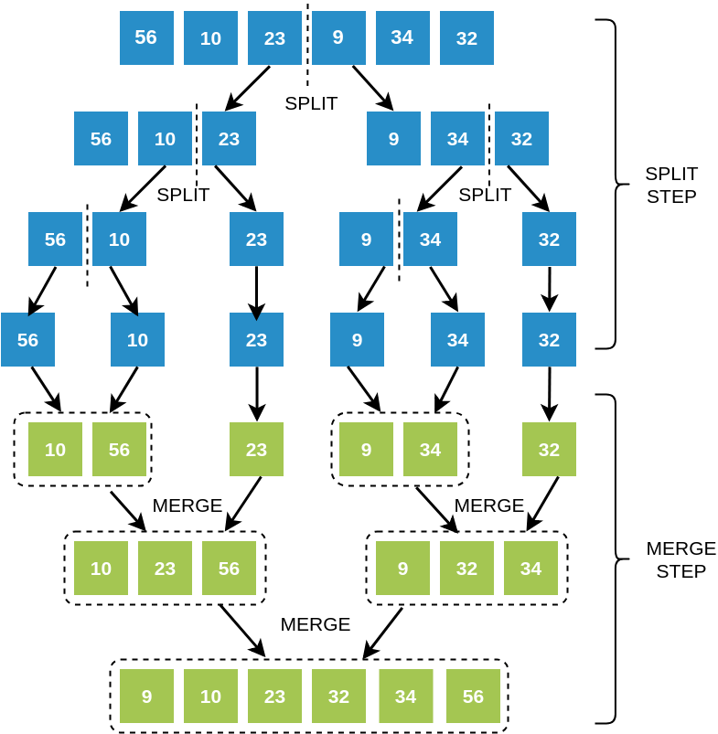

### The Merge Sort Algorithm
The Merge Sort algorithm combines the split and merge step, to give us a sorted array.

    First, we keep splitting the array recursively, till we get all subarrays of size 1. Recall how we practiced this in the Split step
    Then, once the array cannot be split further, we start tracing back on our Merge Sort tree
    As we trace back, we keep merging the child subarrays and overwriting the parent subarrays by their sorted forms.

To get a better overview of how Merge Sort works, look at the video below and then play around with the demo artefact to gain more clarity!
### Merge Sort Tree

### Merge Sort Video
<iframe src="https://www.youtube.com/embed/JSceec-wEyw?start=4&end=79" frameborder="0" allow="autoplay; encrypted-media" allowfullscreen></iframe>
