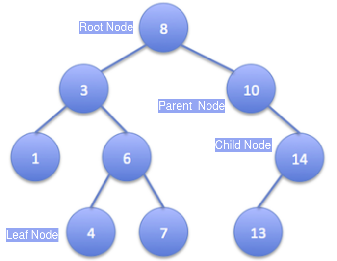
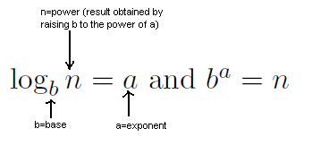

### What is Sorting?

Given a list of random numbers, sorting means ordering the numbers in either ascending or descending order. By default, we sort numbers in an ascending order.

### Unsorted and Sorted Arrays

### What is a Binary Tree?

Trees are hierarchical data structures.

   - The topmost node is called root of the tree.
   - The elements that are directly under an element are called its children.
   - The element directly above something is called its parent.
   - In a binary tree, a given node can have at maximum 2 children.
   - Leaf nodes are those having no children.

### Binary Tree

### Logarithm

### Estimated Time for Pre Test Quiz

10 minutes
### Instructions for Pre Test Quiz

   - Pretest includes questions on **sorting, binary trees and logarithms**.
   - If you want to revise these topics before taking the quiz, go through the Recap module first.
   - Read the questions in the quiz section and select the correct option from the ones provided. Please note that some **questions may have more than one correct response**.

