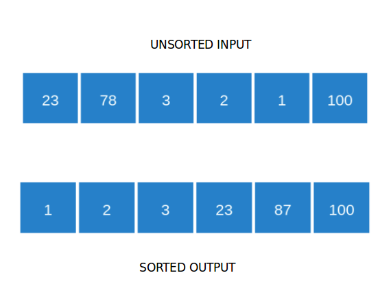

### What is Sorting?

Given a list of random numbers, sorting means ordering the numbers in either ascending or descending order. By default, we sort numbers in an ascending order.

### Unsorted and Sorted Arrays

### What is a Binary Tree?
Trees are hierarchical data structures.

   - The topmost node is called root of the tree.
   - The elements that are directly under an element are called its children.
   - The element directly above something is called its parent.
   - In a binary tree, a given node can have at maximum 2 children.
   - Leaf nodes are those having no children.

### Binary Tree

### Logarithm

